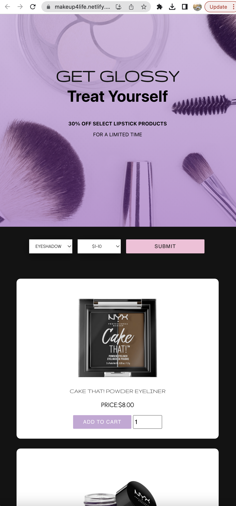
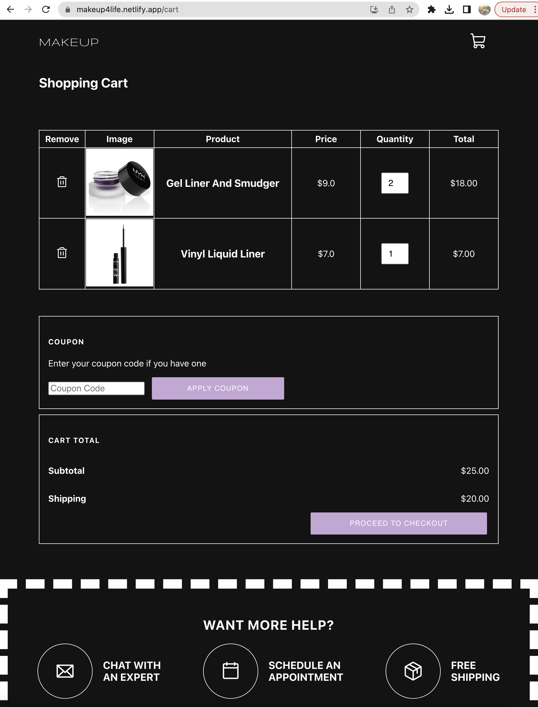

# Makeup4Life: Choose your perfect makeup product!  

[Makeup4Life Live Link](https://makeup4life.netlify.app/)

## About

Welcome to Makeup 4 Life, a React application designed to assist users in selecting their ideal makeup products. With Makeup 4 Life, users have the ability to filter products by type and price.

To get started, simply choose the desired makeup products and set the preferred price range. Based on your selections, the app will generate a list of makeup products tailored to your preferences. You can then add the products to your shopping cart and proceed to the cart page to review your order. If you change your mind, you can easily remove any unwanted products.

Makeup 4 Life was built by [Renata Reinartz](https://github.com/renata1026)

Thank you for your interest in Makeup 4 Life!  Your interest in Makeup 4 Life is greatly appreciated! I hope you find it useful and look forward to receiving your feedback.

## Advanced Web Development tools used in this project

**The Makeup4Life Store  incorporates the following advanced web development tools:

* Mobile-first design implemented with a grid layout
* Utilization of the React library
* SASS employed for CSS styling
* Local storage employed for storing saved products in the cart
* Content is generated using the Makeup API (https://makeup-api.herokuapp.com/)

Thank you for choosing Makeup 4 Life! We strive to provide you with the perfect makeup products to enhance your beauty routine.

## Features

* Product Filtering: Users can filter makeup products based on specific criteria such as brand, shade, or skin type.
* Product Details: Each makeup product listing provides detailed information such as ingredients, usage instructions, and customer reviews.
* The Add to Cart feature allows users to conveniently select and store products they intend to purchase in their virtual shopping cart. 

## Screenshots

<table>
  <tr>
    <td></td>
    <td></td>
    <td></td>
   </tr>
</table>

 

